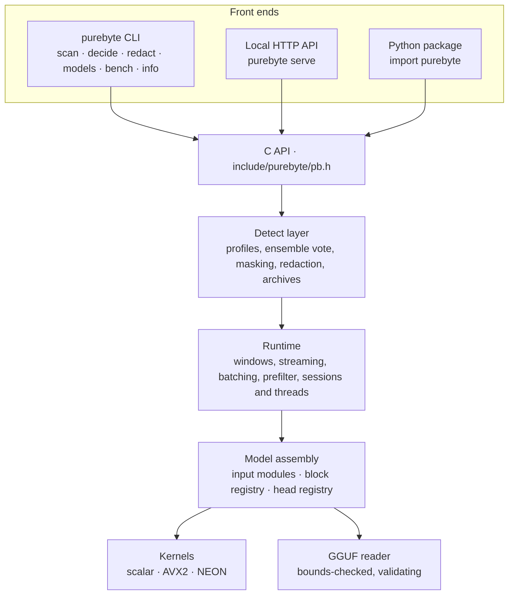
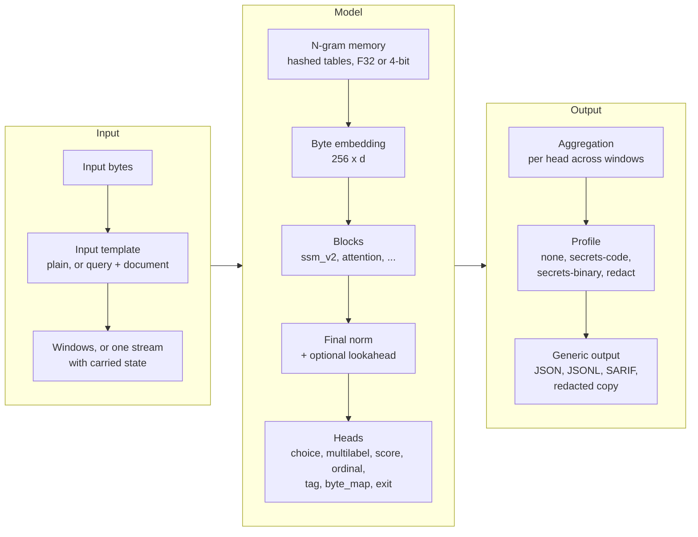

# Architecture

How the runtime is built and how a model is executed, for contributors and for anyone who wants to know exactly what
runs on their machine. The ideas behind it are explained more gently in [how-it-works.md](how-it-works.md). The
authoritative references are the specifications: [spec/FORMAT.md](../spec/FORMAT.md) (model files) and
[spec/OUTPUT.md](../spec/OUTPUT.md) (results).

## Components

| Part | Where | Notes |
|---|---|---|
| `libpurebyte` | [engine/](../engine/) | C++17, no third-party dependencies; builds as a static or shared library |
| C API | [engine/include/purebyte/pb.h](../engine/include/purebyte/pb.h) | The only stable interface; every front end sits on it |
| `purebyte` CLI and HTTP server | [cli/](../cli/) | One self-contained binary; the HTTP server uses the vendored single-header cpp-httplib |
| Python package | [python/](../python/) | `ctypes` bindings over the library, and the same CLI |
| Reference implementation | [reference/](../reference/) | A small NumPy forward pass, readable next to the specification |
| Tests | [tests/](../tests/) | Unit, golden and exactness tests on random models generated from the specification |
| Training stack | Its own repository, [purebyte-train](https://github.com/purebyte-ai/purebyte-train): [training/](https://github.com/purebyte-ai/purebyte-train/blob/main/training/README.md), [specialists/](https://github.com/purebyte-ai/purebyte-train/blob/main/specialists/README.md), [data/](https://github.com/purebyte-ai/purebyte-train/blob/main/data/README.md) | PyTorch, on a CPU or an AMD Radeon GPU (tested on Windows; NVIDIA, Linux ROCm and Apple silicon GPUs run the same stock PyTorch code but have not been run by the maintainers yet); not part of the runtime. It trains span-finding models (a `tag` head gated by a `choice` head), writes model files that follow the specification and checks that the runtime gives the same answers as the trained model ([training.md](https://github.com/purebyte-ai/purebyte-train/blob/main/docs/training.md)) |

## The model file

A model is one GGUF file (version 3) whose `general.architecture` is `purebyte`. Its metadata declares everything the
runtime needs, and its tensors hold the weights:

- **Hyper-parameters**: model width, number of layers, state-space dimensions, the group size of the ternary weights.
- **Input modules**: for example n-gram memory tables, their precision (32-bit float or 4-bit) and where they are
  injected.
- **Body**: the ordered list of blocks, each of a registered type.
- **Heads**: each with its type, label names, pooling, gating by another head, document-level aggregation and
  operating point.
- **Context**: the window size and stride the model was trained with, or streaming.
- **Profile**: the post-processing that turns raw head outputs into results (`none` when absent).

The reader is bounds-checked and strict. It refuses a file that is truncated or contradicts itself, a type it does
not implement (reporting the type and the format version that introduced it), and a file with tensors that no part of
the declared model uses. It never guesses. Declaring models this way is what makes the runtime universal: see
[customize.md](customize.md).

## Executing a model

1. **Input template.** Most models read the input as it is. Query-conditioned models (extraction by question) read
   the question followed by the document, as the model declares.
2. **Windows or stream.** The input is cut into windows of the declared size and stride (512 and 384 bytes for the
   example specialists). Windows are independent: they run in parallel, and a window's result depends only on its
   bytes. Windows under the model's `window.min` are not evaluated (24 bytes unless the model declares another; the
   released `pii` declares 1): one last full window aligned to the end of the input covers those bytes instead, which
   the released models' size and stride never need. Redaction evaluates inputs of any length. Models trained for it can
   instead run as one stream in chunks, carrying the state from chunk to chunk, with results identical to a single
   pass.
3. **Embedding and n-gram memory.** Each byte selects a row of a 256-row embedding. When a model declares n-gram
   memory, a rolling hash of the last *n* bytes selects one row of a large table for each declared order *n*; the
   rows are concatenated, projected to the model width and added, at the input or before a declared layer, optionally
   through a learned gate. Tables can be stored at 4 bits with one scale per row; they account for most of the size
   of a model such as secrets-bin.
4. **Blocks.** The main block type, `ssm_v2`, is a Mamba-2 style selective state-space block: RMS normalization,
   a ternary input projection, a short depthwise causal convolution with SiLU, a selective scan (per-head step size
   from a softplus, decay, input and output projections, skip term), a gated RMS normalization, a ternary output
   projection and a residual connection. It can read causally or in both directions. The registry also holds an
   attention block.
5. **Final normalization and lookahead.** An optional small anticausal convolution lets each position look a few
   bytes ahead before the heads.
6. **Heads.**

   | Head | Output | Typical use |
   |---|---|---|
   | `choice` | Probabilities over N classes from a pooled sequence (last, mean, max, or combinations) | Document decision, gate for other heads |
   | `multilabel` | One independent probability per label | Several properties at once |
   | `score` | Real values | Risk or severity |
   | `ordinal` | Cumulative probabilities over ordered levels | Grades |
   | `tag` | Per-byte labels (begin, inside, end, single, outside) for *k* entity types, decoded into spans | Where things are |
   | `byte_map` | One label per byte | Per-byte maps |
   | `exit` | A linear probe after an early layer | Early exit on clearly negative windows |

   The tag head is decoded by a Viterbi pass that only allows consistent label sequences. Its operating point, a bias
   added to every non-outside label, is stored in the model and can be overridden, globally or per entity type. A
   head can be gated by a choice head: when the gate says no, the gated head is not evaluated.
7. **Aggregation.** Each window-level head (`choice`, `multilabel`, `score`, `ordinal`) declares how its window values
   combine into a document value (`max`, `mean`, `vote`, `any`, and `min` for `score`). The outputs of `tag` and
   `byte_map` heads are never aggregated: spans are collected from every window, and byte maps are merged by position.
8. **Profile.** The declared post-processing turns spans and decisions into results. See
   [Profiles](#profiles-the-detect-layer).

## Ternary weights

The large projections store each weight as -1, 0 or +1, four weights per byte, with one 32-bit scale per group of
input weights (the group size is declared in the file; 128 in the example specialists, so 2.25 bits per weight). At
load, the codes are unpacked to one signed byte per weight. To multiply, a kernel expands each row to 32-bit floats
(code times scale, which is exact) and computes the dot products with fused multiply-adds in the fixed order of the
numerics contract. Everything else (normalizations, convolutions, step-size projections, heads, n-gram projections)
is small and kept in 32-bit floating point.

## Kernels

| Kernel | Where | Role |
|---|---|---|
| `scalar` | Everywhere | Portable, and the executable specification of the arithmetic |
| `avx2` | x86-64 with AVX2 and FMA, chosen at run time | Default on x86-64, including machines with AVX-512 |
| `neon` | arm64 (Apple silicon, Linux arm64) | Default on arm64 |

`auto` picks the best kernel the CPU has; a specific kernel can be forced for testing.

## Numerics and exactness

- **Same bits across kernels.** On a given platform, the scalar, AVX2 and NEON kernels produce bit-identical results:
  they use the same fused multiply-add lanes, the same summation tree and the same order of operations, and the scalar
  path uses its own correctly rounded fused multiply-add.
- **Across operating systems, the same decisions are expected.** Math libraries differ slightly between operating
  systems, and the layers amplify their differences in the last place: raw scores can differ slightly (the tests allow
  a relative difference of 1e-4; observed differences use about 1.5 % of that), and decisions and spans are expected
  to agree, which the golden tests check by comparing them exactly ([spec/FORMAT.md](../spec/FORMAT.md) §5,
  [tests/README.md](../tests/README.md)).
- **Same results at any thread count.** Work is split so that every value is computed in the same order whatever the
  number of threads.
- **Checked against the trained models**: before release, the training stack's `verify` stage ran each released file
  in this engine against the trained model in PyTorch and found the same spans on every test window it compares
  (2,000 for the credential examples, 40 for `pii`).
- **Opt-in accelerations that are not exact by construction** are labeled as such: the string prefilter and early
  exit.

## Sessions and threads

A loaded model is immutable and can be shared by any number of threads. A **session** owns worker threads and
scratch memory. Windows of a batch run in parallel on the session's threads, and when a batch has fewer windows than
threads, idle threads can cooperate inside one window to cut the latency of a single small input.

## Profiles: the detect layer

The engine itself knows nothing about secrets or personal data. A **profile** is a post-processing module selected by
the model file (or overridden by the caller):

| Profile | What it does |
|---|---|
| `none` | Returns the heads' outputs in the generic schema: decisions, labels, scores, spans, fields, byte maps |
| `secrets-code` | Text pipeline: detects UTF-16 and converts it in memory, merges spans across windows, applies format rules (assignments, PEM blocks, credentials inside base64 blobs and data URIs, well-known documentation examples), votes across an ensemble, masks values, computes lines and columns |
| `secrets-binary` | Binary pipeline: merges spans, reports byte offsets and the surrounding printable string, and on request (`PB_DETECT_STRINGS_ONLY`, which the CLI, the HTTP API and the Python package set unless told otherwise) keeps only spans that touch a printable string; spans in the metadata of signed JARs (manifest and signature-file digests, `SHA-256-Digest: ...`, and entry paths, `Name: ...`) are dropped, since a digest is a hash and a name a path |
| `redact` | Redaction by copy: replaces each span with a typed marker, checks that everything outside the spans is unchanged, builds a report without values and, on request, a reversible map |

The detect layer also expands archives (zip and its relatives such as jar and apk, gzip, tar) recursively, with
limits on depth, size, total work, compression ratio, name length and failures listed against archive bombs, and
reports members as `outer.jar!/inner/path`.

## Where to start reading the code

| Directory | Contents |
|---|---|
| `engine/src/format/` | GGUF reader |
| `engine/src/kernels/` | Kernel table and dispatch |
| `engine/src/model/` | Model assembly, projections, n-gram memory, lookahead |
| `engine/src/blocks/` | Block interface and registry |
| `engine/src/heads/` | Head interface and registry, decoding |
| `engine/src/runtime/` | Windows, batches, streaming, prefilter, sessions |
| `engine/src/detect/` | Profiles, ensemble, masking, redaction, archives, result JSON |
| `engine/src/api/` | The C API |

How to add a block, a head, a profile or a kernel: [AGENTS.md](../AGENTS.md#extending-the-runtime).
