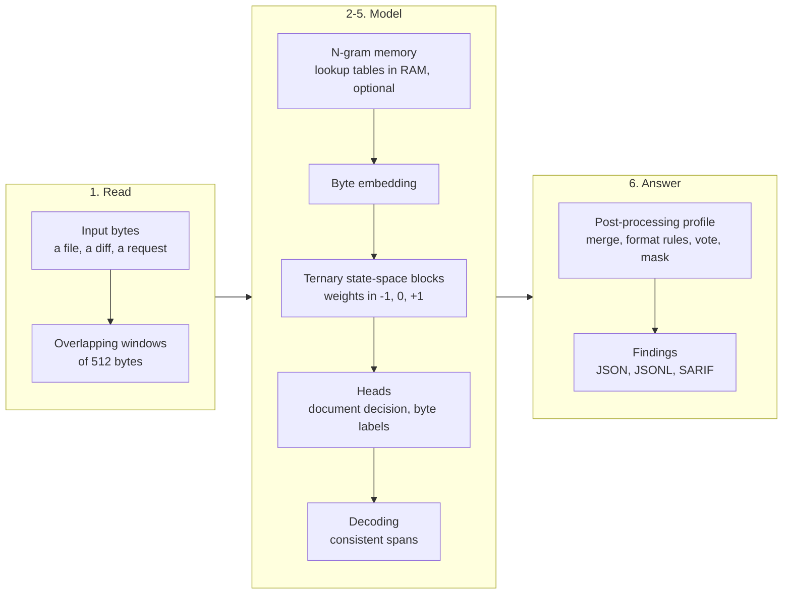

# How PureByte works

This page explains the ideas in plain words. The engineering details (tensors, kernels, numerics) are in
[architecture.md](architecture.md); the file format is specified in [spec/](../spec/).

## One idea: read bytes, point at bytes

PureByte's models are **AI Specialists**: small neural networks, each built for one task, that read the raw bytes of
their input, in order, and answer with a **decision** ("is there a credential in here?") or a **position** ("bytes
120 to 152 are one"). They never write new text. Every answer is a choice among options declared in the model file, a
score, or a range of bytes that exist in the input.

That has a useful consequence: a specialist can be wrong (it can miss something, or flag something harmless), but it
**cannot hallucinate**. There is no generated sentence, no invented value, and nothing to parse out of free-form
output.

## Why bytes?

Large language models read text through a tokenizer, a fixed vocabulary of word pieces learned from natural
language. That works well for prose and poorly for the things security and data tools look at all day:

| Input | What a tokenizer does with it | What a byte model sees |
|---|---|---|
| An API key such as `sk_live_...` | Splits the random part into arbitrary, unstable fragments | Every character, in order |
| Base64, hex, minified code, logs | Long runs of rare pieces | The exact bytes and their rhythm |
| UTF-16 text, binaries, firmware | Often cannot represent them at all | Just more bytes |
| A position in a file | Has to be mapped back from tokens, approximately | Is the output itself: byte offsets |

Reading bytes directly also keeps models small: the input "vocabulary" is 256 values, so the byte embedding has only
256 rows, and the model spends its capacity on the task instead of on language. Knowledge of longer patterns goes into
the optional n-gram tables, which hold most of the parameters of `pii` and `secrets-bin`.

## What a specialist can answer

The runtime supports several kinds of answers, and each specialist declares which ones it produces:

| Answer | Example |
|---|---|
| Decision (one of N) | "This request is an attack" |
| Several labels at once | "Contains personal data; contains a credential" |
| Score | A risk between 0 and 1 |
| Typed spans | "Bytes 120-152 are a password; bytes 300-318 are an email address" |
| Extraction by question | "The value of `password` is at bytes 88-104" |
| Per-byte map | How suspicious each byte looks |
| Redacted copy | The same file, byte for byte, with each span replaced by a typed marker |

The three example specialists of the first release, `pii`, `secrets-code` and `secrets-bin`, answer with typed spans
gated by a window-level decision. The exact list of answer types and their availability is in [customize.md](customize.md).

## What happens during a scan

1. **Windows.** Long inputs are cut into overlapping windows (512 bytes, a new one every 384 bytes, for the
   example specialists). Windows are independent, so they run in parallel and every result depends only on the bytes of its
   window; the threads can also share the work of a single window, which is what makes one small decision fast. A
   specialist can combine its windows into a document-level answer.
2. **Reading.** Each byte becomes a vector. Some specialists add an **n-gram memory**: large lookup tables, held in
   RAM, that recognize short byte patterns (for example the start of a key format or a common code idiom) with a few
   table lookups per byte. It is the cheapest way to give a small model a lot of knowledge.
3. **Thinking in one pass.** A stack of state-space blocks (the Mamba-2 family) reads the window from start to end,
   carrying a compact memory of what it has seen. The cost grows linearly with the input length, not quadratically as
   in attention.
4. **Ternary weights.** Every weight in the large matrices is -1, 0 or +1, with one scale per group of weights (the
   group size is a setting of each model file, `purebyte.tern.group`: 128 in the released examples). A zero means
   "not connected". With groups of 128, weights take 2.25 bits each on disk, scales included, which is why the files
   are measured in megabytes. The models learn with these weights from the first training step, so nothing is lost in
   a conversion afterwards.
5. **Answering.** Small heads turn the result into answers: a document head decides whether the window contains
   anything at all, and a byte-labeling head marks where each span begins, continues and ends. A decoder (Viterbi)
   picks the most likely consistent set of spans; the model's operating point shifts it toward precision or recall.
6. **Post-processing.** The model file declares a post-processing profile. For secrets it merges overlapping
   windows, follows format rules (a PEM block is one finding; a credential inside a base64 blob is decoded and
   located), lets an ensemble of models vote, and masks the values before anything is printed.

## Cascades: spend compute only where it matters

Most bytes of most files contain nothing of interest, so the runtime can skip work in stages:

| Stage | What it skips | Status |
|---|---|---|
| String prefilter | Windows of a binary with no printable text (no run of 16 or more ASCII or UTF-16 characters) | Available, opt-in |
| Early exit | The remaining layers, when a small probe after the first layers says a window is clearly clean | Available for models that ship an exit head |
| Fast model, then a judge | A larger model reviews only the few candidates the small one flags | Planned ([roadmap](roadmap.md)) |

## Same bytes, same answer

A specialist is deterministic: on one platform, the same model and the same input give the same findings on every
run, bit for bit, with any kernel and at any number of threads. The engine's optimized kernels are tested to produce
the same results as its portable reference path, and the test suite locks the behavior with golden files. Across
operating systems, raw scores can differ slightly (math libraries differ) and the findings are expected to be the same
([architecture.md](architecture.md#numerics-and-exactness)).

## Where specialists come from

Each specialist is trained from a recipe: a data generator that plants realistic examples, and look-alikes that are
not, into real public data; success criteria written before training; evaluation on real data kept apart from the
training data; and an export to the model file that the runtime runs. All of it is in the training repository,
[purebyte-train](https://github.com/purebyte-ai/purebyte-train), and an AI coding agent can drive it from a plain
description of the task: see [training.md](https://github.com/purebyte-ai/purebyte-train/blob/main/docs/training.md).

## What PureByte is not for

Summarizing, translating, writing, answering open questions, multi-step reasoning, or anything that needs broad
knowledge of the world. Those are jobs for large language models. PureByte's job is narrower: **decide and point at
bytes, quickly, cheaply and locally**, for tasks where that is exactly what is needed.
